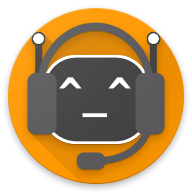

# Pluriphony - A Discord bot <br> for managing vocal debates
#### *create a waitlist for your vocal channel, manage  participant's speaking time and log it in a leaderboard!*
[](http://makeapullrequest.com)

**Pluriphony** is a bot that allows you to manage your vocal debates on DIscord.

## Tour
//todo

## Installation

you can host the bot yourself on any platform you want.<br>
follow the 4 first steps of 
<a href="https://www.digitaltrends.com/gaming/how-to-make-a-discord-bot/">this tutorial</a>
to create a Discord bot and retrieve its API token.

pull this repo and add a file "token.json" like this:

```json
{"token": "Your Bot Token"}
```

run the script ```launcher.sh``` to install all dependencies and start the bot. You're all done!<br>
The script is configured for Linux (Ubuntu/Debian/Arch), but you could adapt it for Windows, or use
<a href="https://docs.microsoft.com/en-us/windows/wsl/install-win10">WSL</a>.

## Usage

we you added the bot to your Discord guild, type ```py configure``` to set up the bot.
only users with admin rights on the guild can run this first command.

This will open a private conversation with the bot, where you will be able to set its language, 
the channels it should be active on and the roles it should take in account.

you will be able to change all these options after.
type ```py -h``` to show a list of commands that are available, with their decription,
or check the <a href="wiki">Wiki</a> for a more detailed tour of the bot's features.


## License

Released under the [GNU GPL v3](LICENSE).
The bot icon headphones are from SVG Repo, under [CC BY 4.0](LICENSE)


*Pluriphony is inspired by another project I am working on: Polyvox,
a complete platform for audiovisual debate, with a built-in moderation ensuring equal speaking time for everyone.
More news about it soon!*
